# go-db
A simple database for learning, inspired by https://cstack.github.io/db_tutorial

roadmap:
- [x] B+Tree
- [x] Simple insert
- [x] Simple select
- [ ] Simple delete
- [ ] Support duplicate key
- [ ] Visualize whole tree from db file

a simple demo:

